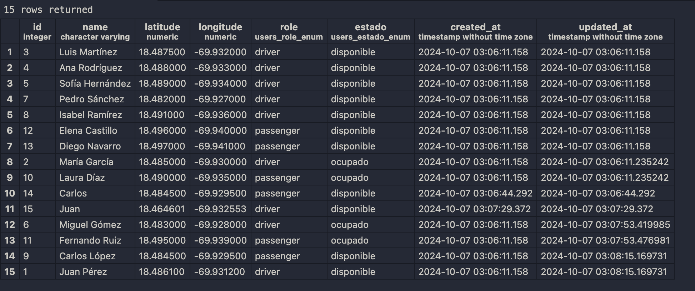
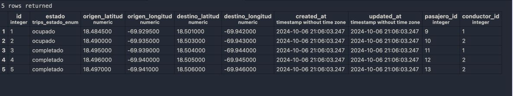
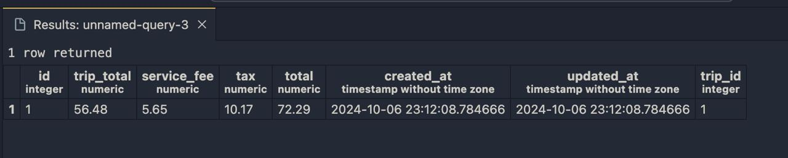

# Code Challenge - API para Gestión de Flotas de Pasajeros

**Taxi24** es una startup innovadora enfocada en transformar la industria del transporte mediante el desarrollo de una solución de marca blanca. Esta solución consiste en un conjunto de APIs que permiten a otras empresas gestionar eficientemente sus flotas de vehículos y pasajeros. Este proyecto es una implementación de dichas APIs, diseñada para facilitar la asignación de conductores, la creación y finalización de viajes, y la gestión de usuarios dentro de la plataforma.

## Instalación y Ejecución

### Requisitos Previos
- **Docker** v20 o superior y **Docker Compose** v1 o superior
- **Node.js** v18 o superior

### Instrucciones de Instalación

1. Clona el repositorio en tu máquina local:

    ```bash
    git clone https://github.com/rcarlosjorge/Code-Challenge.git
    ```

2. Asegúrate de tener Docker y Docker Compose instalados en tu máquina. Si no los tienes, puedes instalarlos siguiendo las instrucciones en la [documentación oficial de Docker](https://docs.docker.com/get-docker/).

3. Construye y levanta los servicios (API y base de datos PostgreSQL) usando Docker Compose:

    ```bash
    docker compose up --build
    ```

    > Esto construirá la imagen de la aplicación definida en el `Dockerfile` y levantará el servicio de PostgreSQL. La API correrá en el puerto `3000` y la base de datos en el puerto `5432`.

4. La lógica para la inicialización de la base de datos con datos dummy está integrada directamente en los scripts del archivo `package.json`. Al levantar los contenedores, el comando `npm run seed:run` se ejecutará automáticamente antes de iniciar la aplicación en modo producción, pre-cargando la base de datos con los datos necesarios.

5. Una vez que los contenedores estén en ejecución, accede a la aplicación a través de `http://localhost:3000`.

### Comandos Útiles

- Para detener y eliminar los contenedores **y la base de datos generada**, ejecuta:

    ```bash
    docker-compose down -v
    ```
    
- Si quieres reconstruir los contenedores después de hacer cambios en el código o en las dependencias:

    ```bash
    docker-compose up --build
    ```


## Archivos Clave
- **docker-compose.yml**: Define los servicios de la aplicación (API y base de datos) y las redes en Docker.
- **Dockerfile**: Define el entorno para construir y ejecutar la aplicación Node.js.
- **package.json**: Contiene los scripts que facilitan la gestión de la aplicación, incluyendo la lógica para ejecutar migraciones y el seeding de la base de datos.

## Descripción de los directorios:
- **/database**: Gestiona la conexión a la base de datos, y los seeds para inicializar la base de datos con data dummy.
- **/modules**: Contiene los módulos principales de la aplicación:
  - **/trips**: Gestión de viajes.
  - **/driver**: Gestión de conductores.
  - **/invoices**: Generación de facturas en formato PDF.
  - **/passenger**: Gestión de pasajeros.
  - **/templates**: Almacena el modelo HTML de la factura que es utilizado para generar PDFs con Puppeteer.   
  - **/utils**: Contiene utilidades o funciones auxiliares utilizadas en varios módulos de la aplicación.

## Arquitectura de la Base de Datos

El esquema de la base de datos está compuesto por varias tablas que gestionan tanto a los usuarios (conductores y pasajeros) como los viajes, facturas, y otros aspectos clave del sistema. Se utilizan enumeraciones y relaciones entre tablas para garantizar una estructura eficiente y facilitar las consultas y operaciones dentro de la plataforma.

### Tabla `users`

### Comando SQL para Crear la Tabla `users`

La tabla `users` gestiona tanto a pasajeros como conductores, permitiendo un manejo unificado de roles y estados. Con campos para coordenadas geográficas, facilita la búsqueda de conductores cercanos y la asignación eficiente de viajes mediante el uso de enumeraciones para roles y estados de disponibilidad.

El siguiente comando SQL crea la tabla `users`, que es fundamental para gestionar los usuarios de la plataforma:

```bash
CREATE TABLE users (
  id SERIAL PRIMARY KEY,
  name VARCHAR(255) NOT NULL,
  latitude DECIMAL(9, 6),
  longitude DECIMAL(9, 6),
  role user_role_enum DEFAULT 'passenger' NOT NULL,
  estado users_estado_enum DEFAULT 'disponible' NOT NULL,
  created_at TIMESTAMP DEFAULT CURRENT_TIMESTAMP,
  updated_at TIMESTAMP DEFAULT CURRENT_TIMESTAMP
);

-- Definir el tipo ENUM para los roles de usuario
CREATE TYPE user_role_enum AS ENUM ('driver', 'passenger', 'both');

-- Definir el tipo ENUM para el estado del viaje
CREATE TYPE users_estado_enum AS ENUM ('disponible', 'ocupado', 'completado', 'cancelado');
```

La tabla User se visualiza de esta forma:
   
   
   
### Tabla `trips`

La tabla trips gestiona los detalles de los viajes realizados en la plataforma. Cada viaje está asociado a un pasajero y un conductor, lo que se maneja mediante relaciones de clave foránea a la tabla `users`. Además, incluye información sobre las coordenadas de origen y destino del viaje, así como su estado (activo, completado, etc.). Esta tabla también está relacionada con la tabla `invoices`, lo que permite generar una factura vinculada a cada viaje realizado.

### Comando SQL para Crear la Tabla `Trips`

```bash
CREATE TABLE trips (
  id SERIAL PRIMARY KEY,
  estado trips_estado_enum DEFAULT 'activo' NOT NULL,
  origen_latitud DECIMAL(9, 6) NOT NULL,
  origen_longitud DECIMAL(9, 6) NOT NULL,
  destino_latitud DECIMAL(9, 6) NOT NULL,
  destino_longitud DECIMAL(9, 6) NOT NULL,
  created_at TIMESTAMP DEFAULT CURRENT_TIMESTAMP,
  updated_at TIMESTAMP DEFAULT CURRENT_TIMESTAMP,
  pasajero_id INTEGER REFERENCES users(id),
  conductor_id INTEGER REFERENCES users(id)
);

-- Definir el tipo ENUM para el estado del viaje
CREATE TYPE trips_estado_enum AS ENUM ('disponible', 'ocupado', 'completado', 'cancelado');
```

La tabla `trips` se visualiza de esta forma:



### Tabla `invoices`

La tabla `invoices` se encarga de almacenar los detalles de las facturas generadas por los viajes en la plataforma. Cada factura está asociada a un viaje mediante una relación uno a uno con la tabla `trips`. Los campos clave incluyen el total del viaje, la tarifa de servicio y los impuestos aplicables, junto con la fecha de creación y actualización de la factura.

El siguiente comando SQL crea la tabla `invoices`:

```bash
CREATE TABLE invoices (
  id SERIAL PRIMARY KEY,
  trip_total DECIMAL(10, 2) NOT NULL,
  service_fee DECIMAL(10, 2) NOT NULL,
  tax DECIMAL(10, 2) NOT NULL,
  total DECIMAL(10, 2) NOT NULL,
  created_at TIMESTAMP DEFAULT CURRENT_TIMESTAMP,
  updated_at TIMESTAMP DEFAULT CURRENT_TIMESTAMP,
  trip_id INTEGER UNIQUE REFERENCES trips(id)
);
```

La tabla `Invoices` se visualiza de esta forma:



### Tabla `Config`

La tabla `Config` almacena variables dinámicas clave para la operación del sistema, como el precio por kilómetro (`price_per_km`), el porcentaje de tarifa de servicio (`service_fee_percentage`), el porcentaje de impuestos (`tax_percentage`), y otros valores importantes como la distancia de búsqueda de conductores (`distance_km`). Esta tabla permite cambiar valores globales sin necesidad de modificar el código de la aplicación, haciendo que ajustes en la lógica del negocio se puedan realizar fácilmente a través de actualizaciones en la base de datos.

El siguiente comando SQL crea la tabla `Config`:

```bash
CREATE TABLE config (
  id SERIAL PRIMARY KEY,
  price_per_km DECIMAL(10, 2) NOT NULL,
  service_fee_percentage DECIMAL(5, 2) NOT NULL,
  tax_percentage DECIMAL(5, 2) NOT NULL,
  distance_km DECIMAL(5, 2) NOT NULL
);
```

La tabla `Config` se visualiza de esta forma:


 
## Funcionalidades Implementadas

### Endpoints de Pasajeros

1. **Buscar conductores cercanos**
   - `GET /passengers/nearest-drivers`
   - Devuelve los tres conductores más cercanos a las coordenadas del pasajero.

2. **Listar todos los pasajeros**
   - `GET /passengers`
   - Retorna una lista de todos los pasajeros.

3. **Obtener un pasajero por ID**
   - `GET /passengers/:id`
   - Devuelve los detalles de un pasajero específico.

4. **Crear un nuevo pasajero**
   - `POST /passengers`
   - Estructura de los datos (tipos de datos):
     ```json
     {
       "name": "STRING",
       "latitude": "NUMBER",
       "longitude": "NUMBER",
       "role": "STRING",
       "estado": "STRING"
     }
     ```

   - Crea un pasajero con la siguiente estructura:

    ```bash
    {
      "name": "Carlos",
      "latitude": 18.4845,
      "longitude": -69.9295,
      "role": "passenger",
      "estado": "ACTIVO"
    }
    ```

 ### Endpoints de Conductores

1. **Buscar conductores cercanos**
   - `GET /drivers/nearest-drivers`
   - Devuelve los conductores disponibles dentro de un radio de 3 km a partir de las coordenadas geográficas proporcionadas.

2. **Listar todos los conductores**
   - `GET /drivers`
   - Retorna una lista de todos los conductores.

3. **Listar conductores disponibles**
   - `GET /drivers/available`
   - Devuelve todos los conductores que están activos y disponibles para tomar viajes.

4. **Obtener un conductor por ID**
   - `GET /drivers/:id`
   - Devuelve los detalles de un conductor específico.

5. **Crear un nuevo conductor**
   - `POST /drivers`
   - 
     Estructura de los datos (tipos de datos):
     ```json
     {
       "name": "STRING",
       "latitude": "NUMBER",
       "longitude": "NUMBER",
       "role": "STRING",
       "estado": "STRING",
       "active": "BOOLEAN"
     }
     ```
    - Crea un conductor con la siguiente estructura:
    
        ```bash
        {
          "name": "Juan",
          "latitude": 18.464601,
          "longitude": -69.932553,
          "role": "driver",
          "estado": "disponible",
          "active": true
        }
        ```

 ### Endpoints de Viajes

1. **Listar todos los viajes activos**
   - `GET /trips/active`
   - Devuelve una lista de todos los viajes que están en curso (estado `OCUPADO`).

2. **Crear un nuevo viaje**
   - `POST /trips`
   - Estructura de los datos (tipos de datos):
     ```json
     {
       "pasajero_id": "NUMBER",
       "origen_latitud": "NUMBER (opcional)",
       "origen_longitud": "NUMBER (opcional)",
       "destino_latitud": "NUMBER",
       "destino_longitud": "NUMBER"
     }
     ```

   - Crea un viaje asignando el conductor más cercano disponible y marca al pasajero y al conductor como ocupados. Si no se especifican las coordenadas de origen (`origen_latitud` y `origen_longitud`), se utilizarán las coordenadas almacenadas del pasajero. Las coordenadas de destino son obligatorias.

     - **Ejemplo de estructura de datos con coordenadas de origen especificadas**:

       ```bash
       {
         "pasajero_id": 1,
         "origen_latitud": 18.4845,
         "origen_longitud": -69.9295,
         "destino_latitud": 18.4745,
         "destino_longitud": -69.9195
       }
       ```

     - **Ejemplo de estructura de datos sin especificar coordenadas de origen (usará las del pasajero)**:

       ```bash
       {
         "pasajero_id": 1,
         "destino_latitud": 18.4745,
         "destino_longitud": -69.9195
       }
       ```

3. **Completar un viaje y generar la factura**
   - `PATCH /trips/:id/complete`
   - Marca el viaje como completado y genera una factura en formato PDF para el mismo. El PDF se devuelve como un archivo descargable.
   
   - Ejemplo de uso en Bash:
    ```bash
    curl -X PATCH "http://localhost:3000/trips/1/complete" --output factura_1.pdf
    ```

- **Factura Generada**: Al completar un viaje, se genera una factura en formato PDF, que incluye todos los detalles del viaje, como el conductor asignado, el pasajero, y las coordenadas del origen y destino. A continuación, un ejemplo visual de la factura generada:


## Decisiones Técnicas

1. **Uso de una única tabla `User` para pasajeros y conductores**:
   - Para simplificar la lógica y evitar la duplicación de código, se utilizó una única tabla `User` para manejar tanto a los pasajeros como a los conductores. Esto permite una mejor reutilización de código, reduce la complejidad del proyecto y facilita la gestión de roles, mejorando la eficiencia en el manejo de relaciones entre usuarios y viajes.

2. **Docker para despliegue rápido y preciso**:
   - Se utilizó **Docker** para contenedorización y despliegue, lo que asegura que la aplicación pueda ser ejecutada de manera rápida y precisa. Esto es particularmente útil para fines de prueba, ya que Docker permite que los seeds de la base de datos se corran automáticamente al iniciar los contenedores, asegurando que los datos estén listos para probar la API sin intervención manual.

3. **Uso de una tabla `Config` para manejar variables dinámicas**:
   - La tabla `Config` almacena valores clave para el sistema como el precio por kilómetro y el porcentaje de tarifa de servicio. Esto permite realizar ajustes globales de manera rápida sin necesidad de cambiar el código o redeployar la aplicación.


## Pruebas

Se han implementado pruebas de servicio para validar el correcto funcionamiento de los módulos clave en la aplicación.

## Pruebas Implementadas

### TripsService

1. **Prueba de inicialización del servicio**:
   - Verifica que el servicio esté correctamente definido.

2. **Prueba para obtener viajes activos**:
   - Simula la consulta de todos los viajes con estado `OCUPADO`.
   - Valida que el repositorio retorne los viajes activos correctamente.

3. **Prueba para crear un viaje**:
   - Simula la creación de un viaje.
   - Verifica que se manejen correctamente los casos donde no se encuentra el pasajero o si el pasajero está en un viaje activo.
   - Valida que se asigne correctamente un conductor disponible y se cree el viaje.

4. **Prueba para completar un viaje y generar factura**:
   - Simula la finalización de un viaje.
   - Verifica que se genera correctamente la factura y se actualizan los estados de pasajero y conductor.
   - Valida que la factura generada sea convertida a un archivo PDF correctamente.

5. **Prueba de excepción para completar un viaje**:
   - Verifica que se lanza una `NotFoundException` cuando el viaje no es encontrado o ya está completado.

### PassengersService

1. **Prueba de inicialización del servicio**:
   - Verifica que el servicio esté correctamente definido.

2. **Prueba para listar pasajeros**:
   - Simula la consulta de todos los pasajeros con el rol `PASSENGER`.
   - Valida que el repositorio retorne los pasajeros correctamente.

3. **Prueba para crear un pasajero**:
   - Simula la creación de un pasajero y guarda el registro.
   - Verifica que se manejen correctamente los estados del pasajero.

4. **Prueba para encontrar conductores cercanos**:
   - Simula la búsqueda de conductores cercanos para un pasajero según las coordenadas dadas.
   - Valida que los conductores se devuelven correctamente según la distancia calculada.

### DriversService

1. **Prueba de inicialización del servicio**:
   - Verifica que el servicio esté correctamente definido.

2. **Prueba para listar conductores**:
   - Simula la consulta de todos los conductores con el rol `DRIVER`.
   - Valida que el repositorio retorne los conductores correctamente.

3. **Prueba para encontrar conductores disponibles en un radio**:
   - Simula la búsqueda de conductores dentro de un radio específico.
   - Verifica que solo se devuelvan los conductores con el estado `ACTIVO`.
   - Valida que la distancia se calcule correctamente.

### TripsController

1. **Prueba de inicialización del controlador**:
   - Verifica que el controlador esté correctamente definido.

2. **Prueba para obtener viajes activos**:
   - Verifica que el controlador llame al servicio de viajes activos y retorne los viajes.

3. **Prueba para crear un viaje**:
   - Verifica que el controlador cree un nuevo viaje llamando al servicio con los datos correctos.

4. **Prueba para completar un viaje y generar PDF**:
   - Verifica que el controlador complete un viaje y retorne un archivo PDF generado correctamente.

### PassengersController

1. **Prueba de inicialización del controlador**:
   - Verifica que el controlador esté correctamente definido.

2. **Prueba para listar pasajeros**:
   - Verifica que el controlador llame al servicio de pasajeros y retorne los pasajeros correctamente.

3. **Prueba para crear un pasajero**:
   - Verifica que el controlador cree un nuevo pasajero llamando al servicio con los datos correctos.

4. **Prueba para encontrar conductores cercanos**:
   - Verifica que el controlador retorne los conductores cercanos llamando al servicio con las coordenadas correctas.

### DriversController

1. **Prueba de inicialización del controlador**:
   - Verifica que el controlador esté correctamente definido.

2. **Prueba para listar conductores**:
   - Verifica que el controlador llame al servicio de conductores y retorne la lista de conductores correctamente.

3. **Prueba para crear un conductor**:
   - Verifica que el controlador cree un nuevo conductor llamando al servicio con los datos correctos.

4. **Prueba para encontrar conductores disponibles en un radio**:
   - Verifica que el controlador retorne los conductores disponibles dentro del radio especificado.


### Ejecución de las pruebas:
Para ejecutar todas las pruebas, utiliza el siguiente comando:

```bash
npm run test
```

 > Al ejecutar este comando, se ejecutarán todas las pruebas unitarias y verás un resumen de los resultados en la terminal. Este resumen incluirá el número de pruebas ejecutadas, cuántas pasaron correctamente y cuántas fallaron. A continuación, se muestra un ejemplo del resultado que verás:
 
 

## Mejoras Futuras

1. **Implementación de un sistema de caché (Redis)**:
   - Para optimizar la respuesta de la API y reducir la carga en la base de datos, se podría implementar un sistema de caché utilizando **Redis**. Esto mejoraría significativamente el rendimiento de la aplicación al almacenar datos frecuentemente consultados en memoria.

2. **Uso de microservicios con MongoDB y Message Broker**:
   - Se podría migrar a una arquitectura de microservicios, utilizando **MongoDB** como servicio externo para manejar partes del sistema, conectado a través de HTTP API y utilizando un sistema de mensajería como **RabbitMQ** o el protocolo TCP de NestJS para la comunicación entre servicios. Esto permitiría escalar la aplicación y mejorar su mantenibilidad y rendimiento.
